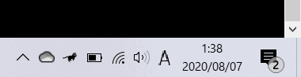

# Running Cat

> 天冷了，任务栏养只猫吧。——[削微寒](https://hellogithub.blog.csdn.net/)

受到Github上[RunCat_for_windows](https://github.com/Kyome22/RunCat_for_windows)项目的启发，自己也动手用`wxPython`造了一个差不多的。

## Demo



（这个是Github上原项目的Demo，效果是一样的就直接拿来用了）

## Run the code

```
pip install wxPython
python main.py
```

## Config

`main.py`中的`mode`，`animal`参数可以修改。

如果任务栏是黑色或深色，则`mode`可以设置为`dark`，反之可以设置为`light`。

`animal`有`cat`和`parrot`两种，当然也可以自己画，尺寸没有严格的规定。

## Stars

如果喜欢这个项目，记得顺手点一个Star哦~